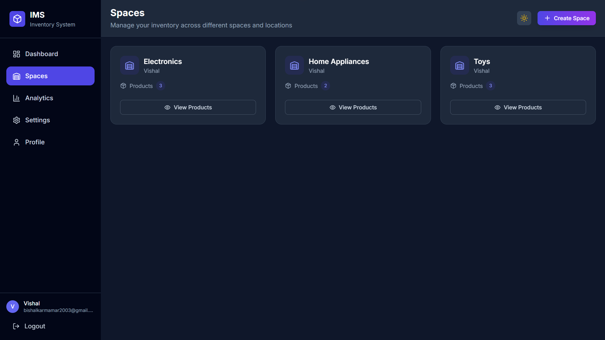
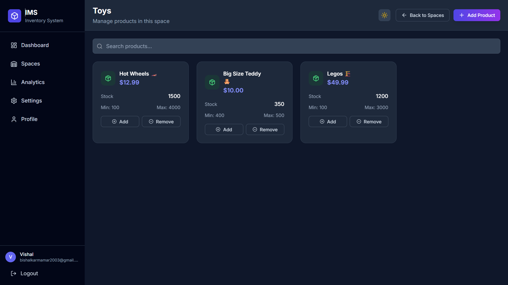

# Inventory Management System (IMS)


A modern, full-stack inventory management application built with React and Spring Boot. Manage your inventory across different spaces and locations with an intuitive, hierarchical organization system.

---

## 📋 Table of Contents

- [Features](#-features)
- [Technology Stack](#-technology-stack)
- [Architecture](#-architecture)
- [Screenshots](#-screenshots)
- [Installation](#-installation)
- [Usage](#-usage)
- [API Documentation](#-api-documentation)
- [Project Structure](#-project-structure)
- [Contributing](#-contributing)
- [License](#-license)
- [Contact](#-contact)

---

## ✨ Features

### 🏠 Space Management
- **Multi-Space Organization**: Create and manage up to 10 different spaces (Electronics, Home Appliances, Toys, etc.)
- **Space Overview**: View all spaces with product counts and quick access
- **Hierarchical Structure**: User → Spaces → Products for logical organization

### 📦 Product Management
- **Product CRUD Operations**: Add, edit, view, and delete products within spaces
- **Smart Stock Control**: Set minimum and maximum quantity thresholds
- **Real-time Stock Updates**: Add/remove stock with instant feedback
- **Product Search**: Search products within specific spaces
- **Low Stock Detection**: Automatic identification of products below minimum thresholds

### 📊 Analytics Dashboard
- **Comprehensive Overview**: Total spaces, products, inventory value, and low stock alerts
- **Visual Charts**: Inventory value by space and product distribution pie charts
- **Price Analysis**: Minimum, maximum, and average price insights
- **Stock Analytics**: Total stock levels and low stock severity breakdown

### 🔐 Authentication & Security
- **Secure Registration**: Email-based registration with OTP verification
- **JWT Authentication**: Secure token-based authentication system
- **Account Management**: User profile management and session control

### 📈 Monitoring & Insights
- **Inventory Trends**: Historical data and trend analysis
- **Audit Logging**: Complete activity tracking for all operations
- **Recent Activity**: Dashboard showing recent inventory changes

---

## 🛠️ Technology Stack

### Frontend
- **React 18** with Vite for fast development
- **Modern JavaScript (ES6+)**
- **Component-based Architecture**

### Backend
- **Java 17** with Spring Boot 3.x
- **Spring Security** with JWT authentication
- **Spring Data JPA** with Hibernate
- **RESTful API** design
- **Bean Validation** for input validation

### Database
- **Relational Database** (H2/MySQL/PostgreSQL compatible)
- **JPA/Hibernate** ORM mapping
- **Database migrations** support

### Additional Features
- **Email Integration** for OTP verification
- **Audit Logging** system
- **CORS Configuration** for cross-origin requests
- **Exception Handling** with custom error responses

---

## 🏗️ Architecture

```
User (1) ──→ Space (Many) ──→ Product (Many)
```

- **User**: Authenticated users can manage their inventory
- **Space**: Logical containers (max 10 per user) for organizing products
- **Product**: Individual items with stock levels, pricing, and thresholds

---

## 📸 Screenshots

### Dashboard Overview


*Main dashboard showing key metrics and recent activity*

### Spaces Management


*Organize inventory across different spaces and locations*

### Product Management




*Detailed product management with stock control*

### Analytics & Insights


*Comprehensive analytics with charts and insights*

### Authentication


*Secure login and registration system*

---

## 🚀 Installation

### Prerequisites
- **Java 17** or higher
- **Node.js 16+** and npm
- **Maven 3.6+**
- **Git**

### Steps

#### 1. Clone the repository
```bash
git clone https://github.com/VishalKmk/Inventory-Management-App.git
cd Inventory-Management-App
```

#### 2. Backend Setup
```bash
cd backend/inventory

# Configure database in application.properties
# Set email configuration for OTP functionality

# Install dependencies and run
mvn clean install
mvn spring-boot:run
```

**Backend will start on** `http://localhost:8080`

#### 3. Frontend Setup
```bash
cd frontend

# Install dependencies
npm install

# Run build command
npm run build

# Start development server
npm run dev
```

**Frontend will start on** `http://localhost:5173`

#### 4. Environment Configuration
```properties
# Backend application.properties
server.port=8080
spring.datasource.url=jdbc:h2:mem:testdb
spring.mail.host=your-smtp-host
spring.mail.username=your-email
spring.mail.password=your-password
```

---

## 📖 Usage

### Getting Started

#### 1. Create Account
- Visit `http://localhost:5173`
- Register with your email
- Verify email with OTP code
- Login to access dashboard

#### 2. Create Your First Space
- Click "Create Space" or "Add Space"
- Name your space (e.g., "Electronics", "Kitchen")
- Start adding products to the space

#### 3. Add Products
- Navigate to a space
- Click "Add Product"
- Fill in product details:
  - Name and price
  - Current stock quantity
  - Minimum and maximum thresholds

#### 4. Manage Inventory
- Use "Add" and "Remove" buttons for stock adjustments
- Monitor low stock alerts in the dashboard
- View analytics for insights

### Key Workflows

- **Stock Management**: Space → Select Product → Add/Remove Stock
- **Monitoring**: Dashboard → View Alerts → Take Action
- **Analysis**: Analytics → Review Charts → Make Decisions

---

## 📚 API Documentation

### Base URL
```
http://localhost:8080/api
```

### Authentication
All endpoints require JWT token except authentication endpoints:
```bash
Authorization: Bearer <your_jwt_token>
```

### Key Endpoints

#### Authentication
- `POST /auth/register` - Register new user
- `POST /auth/verify-otp` - Verify email with OTP
- `POST /auth/login` - User login
- `POST /auth/resend-otp` - Resend verification code

#### Spaces
- `GET /spaces` - Get all user spaces
- `POST /spaces` - Create new space (max 10)
- `PUT /spaces/{id}` - Update space
- `DELETE /spaces/{id}` - Delete space

#### Products
- `GET /spaces/{spaceId}/products` - Get products in space
- `POST /spaces/{spaceId}/products` - Add product to space
- `PUT /spaces/{spaceId}/products/{id}` - Update product
- `POST /spaces/{spaceId}/products/{id}/stock/add` - Add stock
- `POST /spaces/{spaceId}/products/{id}/stock/remove` - Remove stock

#### Analytics
- `GET /dashboard/overview` - Dashboard metrics
- `GET /dashboard/insights` - Inventory insights
- `GET /dashboard/low-stock-alerts` - Low stock alerts

**For complete API documentation, see** [API_documentation.md](API_documentation.md)

---

## 📁 Project Structure

```
Inventory-Management-App/
├── backend/inventory/src/main/java/app/web/inventory/
│   ├── config/         # Config Classes (Global Exception, Security Config)
│   ├── controller/     # REST API endpoints
│   ├── dto/            # Data Transfer Objects
│   ├── model/          # Entities
│   ├── repository/     # JPA entities
│   ├── security/       # Security layer (JWT util & Filter)
│   ├── service/        # Business logic
├── frontend/src/
│   ├── components/     # React components
│   ├── pages/          # Page components
│   ├── hooks/          # Custom React hooks
│   ├── utils/          # Utility functions
│   ├── styles/         # CSS modules
│   └── api/            # API integration
└── API_documentation.md
```

---

## 🤝 Contributing

We welcome contributions! Here's how to get started:

#### 1. Fork the repository

#### 2. Create a feature branch
```bash
git checkout -b feature/amazing-feature
```

#### 3. Make your changes
- Follow existing code style
- Add tests if applicable
- Update documentation

#### 4. Commit changes
```bash
git commit -m 'Add some amazing feature'
```

#### 5. Push to branch
```bash
git push origin feature/amazing-feature
```

#### 6. Open a Pull Request

### Development Guidelines
- Follow Java and React best practices
- Write clear commit messages
- Test your changes thoroughly
- Update API documentation for backend changes

---

## 🐛 Issues & Support

**Found a bug or have a feature request?**
- Check existing [issues](https://github.com/VishalKmk/Inventory-Management-App/issues)
- Create a new issue with detailed description
- Include screenshots for UI-related issues

---

## 📄 License

This project is licensed under the **Apache License 2.0** - see the [LICENSE](LICENSE) file for details.

---

## 📞 Contact

**Vishal Karmakar**
- **GitHub**: [@VishalKmk](https://github.com/VishalKmk)
- **Email**: bishalkarmakar2468@gmail.com

---

## 🙏 Acknowledgments

- Built with modern web technologies
- Inspired by real-world inventory management needs
- Thanks to the open-source community

---

**⭐ Star this repository if you find it helpful!**

---

*Last updated: September 2025*
